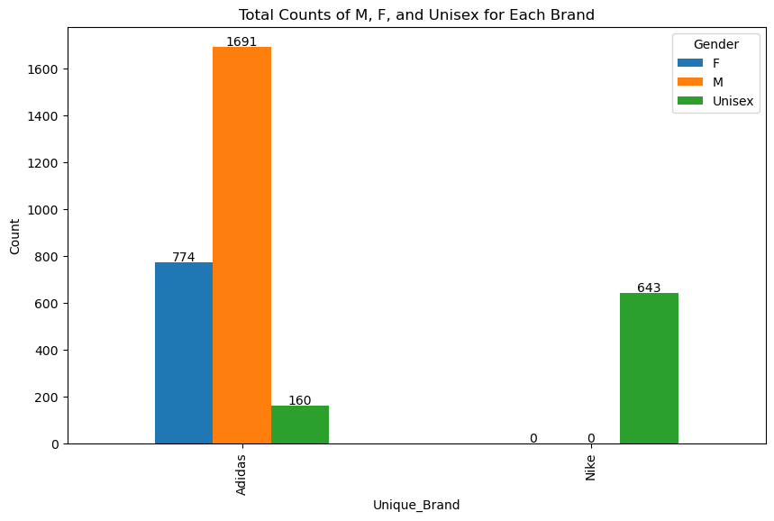
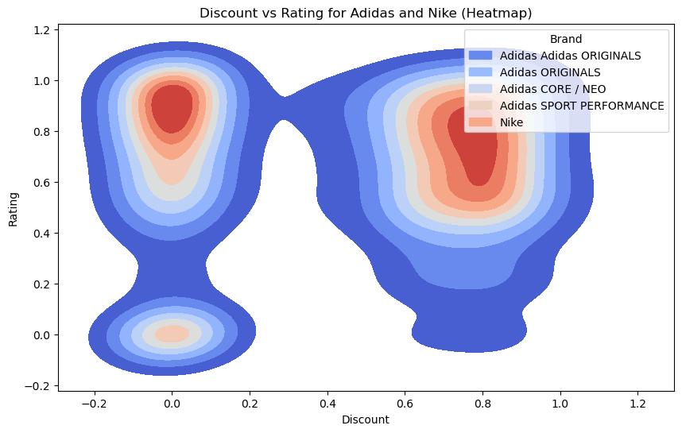
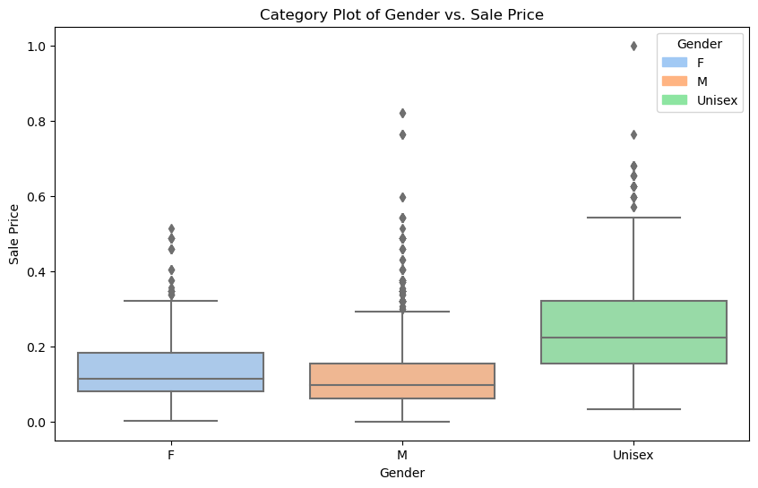
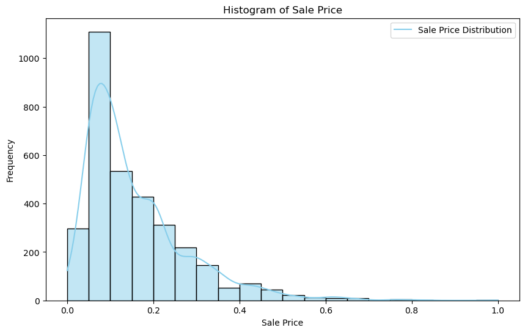
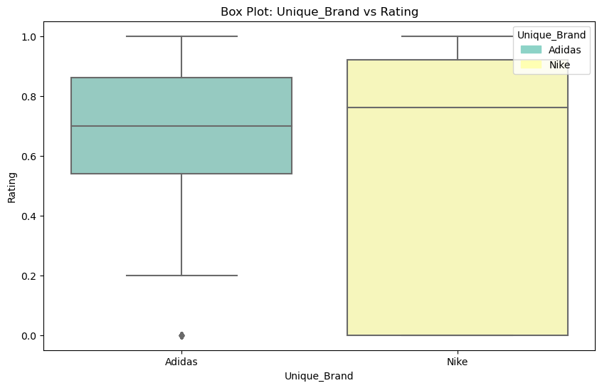
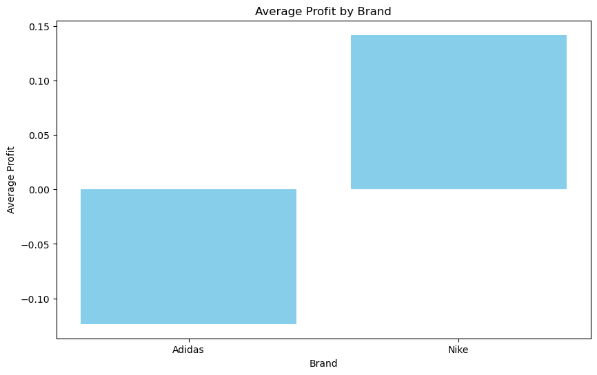

```python
import pandas as pd
import matplotlib.pyplot as plt
import seaborn as sns
import matplotlib.pyplot as plt
df = pd.read_csv('data.csv')
```


```python
print(df.head())
```

                                            Product Name Product ID  \
    0  Women's adidas Originals NMD_Racer Primeknit S...     AH2430   
    1               Women's adidas Originals Sleek Shoes     G27341   
    2                  Women's adidas Swim Puka Slippers     CM0081   
    3   Women's adidas Sport Inspired Questar Ride Shoes     B44832   
    4           Women's adidas Originals Taekwondo Shoes     D98205   
    
       Listing Price  Sale Price  Discount                    Brand  Rating  \
    0          14999        7499        50  Adidas Adidas ORIGINALS     4.8   
    1           7599        3799        50         Adidas ORIGINALS     3.3   
    2            999         599        40        Adidas CORE / NEO     2.6   
    3           6999        3499        50        Adidas CORE / NEO     4.1   
    4           7999        3999        50         Adidas ORIGINALS     3.5   
    
       Reviews  
    0     41.0  
    1     24.0  
    2     37.0  
    3     35.0  
    4     72.0  
    


```python
print("Number of rows and columns:", df.shape)
```

    Number of rows and columns: (3268, 8)
    


```python
print(df.info())
```

    <class 'pandas.core.frame.DataFrame'>
    RangeIndex: 3268 entries, 0 to 3267
    Data columns (total 8 columns):
     #   Column         Non-Null Count  Dtype  
    ---  ------         --------------  -----  
     0   Product Name   3268 non-null   object 
     1   Product ID     3268 non-null   object 
     2   Listing Price  3268 non-null   int64  
     3   Sale Price     3268 non-null   int64  
     4   Discount       3268 non-null   int64  
     5   Brand          3268 non-null   object 
     6   Rating         2966 non-null   float64
     7   Reviews        3011 non-null   float64
    dtypes: float64(2), int64(3), object(3)
    memory usage: 204.4+ KB
    None
    


```python
print(df.describe())
```

           Listing Price    Sale Price     Discount       Rating      Reviews
    count    3268.000000   3268.000000  3268.000000  2966.000000  3011.000000
    mean     6868.020196   6134.265606    26.875765     3.572218    44.012953
    std      4724.659386   4293.247581    22.633487     1.034382    30.455809
    min         0.000000    449.000000     0.000000     1.000000     1.000000
    25%      4299.000000   2999.000000     0.000000     2.800000    16.000000
    50%      5999.000000   4799.000000    40.000000     3.700000    43.000000
    75%      8999.000000   7995.000000    50.000000     4.400000    70.000000
    max     29999.000000  36500.000000    60.000000     5.000000   223.000000
    


```python
null_values = df.isnull().sum()
print(null_values)
```

    Product Name       0
    Product ID         0
    Listing Price      0
    Sale Price         0
    Discount           0
    Brand              0
    Rating           302
    Reviews          257
    dtype: int64
    


```python
df['Rating'].fillna(0, inplace=True)
df['Reviews'].fillna(0, inplace=True)
```


```python
null_values = df.isnull().sum()
print(null_values)
```

    Product Name     0
    Product ID       0
    Listing Price    0
    Sale Price       0
    Discount         0
    Brand            0
    Rating           0
    Reviews          0
    dtype: int64
    


```python
df['Gender'] = df['Product Name'].apply(lambda x: 'M' if x.startswith(('Men', 'MEN')) else 'F' if x.startswith(('Women', 'WOMEN')) else 'Unisex')
print(df['Gender'].head())
```

    0    F
    1    F
    2    F
    3    F
    4    F
    Name: Gender, dtype: object
    


```python
gender_counts = df['Gender'].value_counts()
print(gender_counts)
```

    Gender
    M         1691
    Unisex     803
    F          774
    Name: count, dtype: int64
    


```python
print(df.info())
```

    <class 'pandas.core.frame.DataFrame'>
    RangeIndex: 3268 entries, 0 to 3267
    Data columns (total 9 columns):
     #   Column         Non-Null Count  Dtype  
    ---  ------         --------------  -----  
     0   Product Name   3268 non-null   object 
     1   Product ID     3268 non-null   object 
     2   Listing Price  3268 non-null   int64  
     3   Sale Price     3268 non-null   int64  
     4   Discount       3268 non-null   int64  
     5   Brand          3268 non-null   object 
     6   Rating         3268 non-null   float64
     7   Reviews        3268 non-null   float64
     8   Gender         3268 non-null   object 
    dtypes: float64(2), int64(3), object(4)
    memory usage: 229.9+ KB
    None
    


```python
df['Unique_Brand'] = df['Brand'].apply(lambda x: 'Adidas' if x.startswith('A') else 'Nike' if x.startswith('N') else 'Other')
print(df['Unique_Brand'].head())
```

    0    Adidas
    1    Adidas
    2    Adidas
    3    Adidas
    4    Adidas
    Name: Unique_Brand, dtype: object
    


```python
Unique_Brand_counts = df['Unique_Brand'].value_counts()
print(Unique_Brand_counts)
```

    Unique_Brand
    Adidas    2625
    Nike       643
    Name: count, dtype: int64
    


```python
print(df.info())
```

    <class 'pandas.core.frame.DataFrame'>
    RangeIndex: 3268 entries, 0 to 3267
    Data columns (total 10 columns):
     #   Column         Non-Null Count  Dtype  
    ---  ------         --------------  -----  
     0   Product Name   3268 non-null   object 
     1   Product ID     3268 non-null   object 
     2   Listing Price  3268 non-null   int64  
     3   Sale Price     3268 non-null   int64  
     4   Discount       3268 non-null   int64  
     5   Brand          3268 non-null   object 
     6   Rating         3268 non-null   float64
     7   Reviews        3268 non-null   float64
     8   Gender         3268 non-null   object 
     9   Unique_Brand   3268 non-null   object 
    dtypes: float64(2), int64(3), object(5)
    memory usage: 255.4+ KB
    None
    


```python
null_values = df.isnull().sum()
print(null_values)
```

    Product Name     0
    Product ID       0
    Listing Price    0
    Sale Price       0
    Discount         0
    Brand            0
    Rating           0
    Reviews          0
    Gender           0
    Unique_Brand     0
    dtype: int64
    


```python
grouped = df.groupby(['Unique_Brand', 'Gender']).size().unstack(fill_value=0)
ax = grouped.plot(kind='bar', figsize=(10, 6))
plt.title('Total Counts of M, F, and Unisex for Each Brand')
plt.xlabel('Unique_Brand')
plt.ylabel('Count')
for p in ax.patches:
    ax.annotate(f"{p.get_height()}", (p.get_x() + p.get_width() / 2., p.get_height() + 5), ha='center')
plt.show()
```


    

    


```python
from sklearn.preprocessing import MinMaxScaler
numerical_columns = ['Listing Price', 'Sale Price', 'Discount', 'Rating', 'Reviews']
scaler = MinMaxScaler()
df[numerical_columns] = scaler.fit_transform(df[numerical_columns])
print(df.head())
```

                                            Product Name Product ID  \
    0  Women's adidas Originals NMD_Racer Primeknit S...     AH2430   
    1               Women's adidas Originals Sleek Shoes     G27341   
    2                  Women's adidas Swim Puka Slippers     CM0081   
    3   Women's adidas Sport Inspired Questar Ride Shoes     B44832   
    4           Women's adidas Originals Taekwondo Shoes     D98205   
    
       Listing Price  Sale Price  Discount                    Brand  Rating  \
    0       0.499983    0.195556  0.833333  Adidas Adidas ORIGINALS    0.96   
    1       0.253308    0.092924  0.833333         Adidas ORIGINALS    0.66   
    2       0.033301    0.004161  0.666667        Adidas CORE / NEO    0.52   
    3       0.233308    0.084602  0.833333        Adidas CORE / NEO    0.82   
    4       0.266642    0.098472  0.833333         Adidas ORIGINALS    0.70   
    
        Reviews Gender Unique_Brand  
    0  0.183857      F       Adidas  
    1  0.107623      F       Adidas  
    2  0.165919      F       Adidas  
    3  0.156951      F       Adidas  
    4  0.322870      F       Adidas  
    


```python
discount_bins = [0, 20, 30, 40, 50, 60, float('inf')]
rating_bins = [0, 1, 2, 3, 4, 5]
discount_labels = ['0-20', '21-30', '31-40', '41-50', '51-60', '61+']
rating_labels = ['0-1', '1-2', '2-3', '3-4', '4-5']
df['Discount_Bin'] = pd.cut(df['Discount'], bins=discount_bins, labels=discount_labels, right=False)
df['Rating_Bin'] = pd.cut(df['Rating'], bins=rating_bins, labels=rating_labels, right=False)
print(df[['Discount', 'Discount_Bin', 'Rating', 'Rating_Bin']].head())
```

       Discount Discount_Bin  Rating Rating_Bin
    0  0.833333         0-20    0.96        0-1
    1  0.833333         0-20    0.66        0-1
    2  0.666667         0-20    0.52        0-1
    3  0.833333         0-20    0.82        0-1
    4  0.833333         0-20    0.70        0-1
    


```python
plt.figure(figsize=(10, 6))
combined_data = pd.concat([adidas_data, nike_data])
sns.kdeplot(data=combined_data, x='Discount', y='Rating', fill=True, cmap='coolwarm')
plt.title('Discount vs Rating for Adidas and Nike (Heatmap)')
plt.xlabel('Discount')
plt.ylabel('Rating')
brands = combined_data['Brand'].unique()
legend_labels = [mpatches.Patch(color=sns.color_palette('coolwarm')[i], label=brand) for i, brand in enumerate(brands)]
plt.legend(handles=legend_labels, title='Brand', loc='upper right')
plt.show()
```


    

    


```python
plt.figure(figsize=(10, 6))
ax = sns.boxplot(x='Gender', y='Sale Price', data=df, palette='pastel')
plt.title('Category Plot of Gender vs. Sale Price')
plt.xlabel('Gender')
plt.ylabel('Sale Price')
genders = df['Gender'].unique()
legend_labels = [mpatches.Patch(color=sns.color_palette('pastel')[i], label=gender) for i, gender in enumerate(genders)]
plt.legend(handles=legend_labels, title='Gender', loc='upper right')
plt.show()
```


    

    


```python
plt.figure(figsize=(10, 6))
sns.histplot(df['Sale Price'], bins=20, kde=True, color='skyblue')
plt.legend(['Sale Price Distribution'])
plt.title('Histogram of Sale Price')
plt.xlabel('Sale Price')
plt.ylabel('Frequency')
plt.show()
```


    

    


```python
plt.figure(figsize=(10, 6))
ax = sns.boxplot(x='Unique_Brand', y='Rating', data=df, palette='Set3')
plt.title('Box Plot: Unique_Brand vs Rating')
plt.xlabel('Unique_Brand')
plt.ylabel('Rating')
unique_brands = df['Unique_Brand'].unique()
legend_labels = [mpatches.Patch(color=sns.color_palette('Set3')[i], label=brand) for i, brand in enumerate(unique_brands)]
plt.legend(handles=legend_labels, title='Unique_Brand', loc='upper right')
plt.show()
```


    

    


```python
df['Profit'] = df['Sale Price'] - df['Listing Price']
brand_profit = df.groupby('Unique_Brand')['Profit'].mean().reset_index()
plt.figure(figsize=(10, 6))
plt.bar(brand_profit['Unique_Brand'], brand_profit['Profit'], color='skyblue')
plt.title('Average Profit by Brand')
plt.xlabel('Brand')
plt.ylabel('Average Profit')
plt.xticks(rotation=0)
plt.show()
```


    

    


```python
df['Profit'] = df['Sale Price'] - df['Listing Price']
brand_profit = df.groupby('Unique_Brand')['Profit'].mean().reset_index()
adidas_profit_loss = brand_profit.loc[brand_profit['Unique_Brand'] == 'Adidas', 'Profit'].values[0]
nike_profit_loss = brand_profit.loc[brand_profit['Unique_Brand'] == 'Nike', 'Profit'].values[0]
adidas_result = "Profit" if adidas_profit_loss > 0 else "Loss"
nike_result = "Profit" if nike_profit_loss > 0 else "Loss"
print(f"Adidas: {adidas_result} = {adidas_profit_loss}")
print(f"Nike: {nike_result} = {nike_profit_loss}")
```

    Adidas: Loss = -0.12339183656790897
    Nike: Profit = 0.1416609248593226
    


```python
Conclusion:

The analysis of the dataset, which encompasses products from two prominent sports apparel brands, Adidas and Nike, provides valuable insights into their performance in terms of profit and sales.

Adidas:

Profit and Loss: Adidas experienced a slight loss of approximately -0.1234 in the units of the dataset's currency. This indicates that, on average, Adidas products were sold at a price slightly lower than their listing price.
Sales Volume: Adidas, known for its extensive product range, had a substantial sales volume of 2,625 products. This implies a strong presence in the market and a wide variety of offerings for customers.

Nike:

Profit and Loss: In contrast, Nike achieved a profit of approximately 0.1417. This suggests that, on average, Nike products were sold at a price slightly higher than their listing price. This may indicate the brand's ability to command a premium for its products.
Sales Volume: Nike, with a sales volume of 643 products, may not have as extensive a product range as Adidas, but it demonstrates a successful sales strategy, possibly through higher-priced items or specific market targeting.
In summary, this analysis reveals the diverse strategies employed by Adidas and Nike in the marketplace. Adidas, with its wider product range, aims to capture a larger market share and provides a variety of options to customers. Nike, on the other hand, may focus on offering products that command higher prices and, as indicated by its profitability, successfully implements this strategy.

Both brands have their unique approaches, and this analysis showcases their distinct positions in the market. Ultimately, the choice between offering a wider product range or focusing on higher-priced, premium products depends on each brand's core strategy and target audience. Understanding the performance of these two giants is not only insightful but also serves as a valuable reference for the broader field of brand management and business strategy in the fashion and sportswear industry.
```
